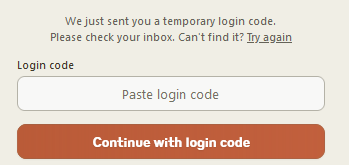

            # ==================================================================================
            # IMPORTANT: This script is currently in development.
            # This repo is a homework problem for my project in berkeley ai safety's supervised program for alignment research.
            # The script is not yet complete and is not guaranteed to work as expected from this point onwards.
            # ==================================================================================

# Export Workbench Chats

This script is designed to automate the export of chat conversations from the Anthropic workbench. It navigates through the Anthropic console, logs in using credentials stored in environment variables, and saves each conversation in a separate folder with the option to output in JSON or plain text format. Additionally, it attempts to capture and save any associated API code for each conversation.

## Features

- Automated login to Anthropic console.
- Navigation to the workbench and extraction of chat conversations.
- Retry mechanism for loading elements.
- Output conversations in JSON or plain text format.
- Capture and save API codes associated with conversations.
- Headless browser support.

## Prerequisites

Before running the script, ensure you have the following installed:

- Python 3.8 or higher
- Playwright Python package
- tqdm (for progress bars)
- python-dotenv (for loading environment variables)

## Installation

1. Clone this repository or download the script.
2. 
   ```bash
   git clone https://github.com/sheikheddy/export-workbench-chats.git
   ```

3. Install the required Python packages in a virtual environment:

    ```bash
    python -m venv venv
    if [ "$(uname)" == "Darwin" ] || [ "$(expr substr $(uname -s) 1 5)" == "Linux" ]; then
        source venv/bin/activate
    elif [ "$(expr substr $(uname -s) 1 10)" == "MINGW32_NT" ] || [ "$(expr substr $(uname -s) 1 10)" == "MINGW64_NT" ]; then
        source venv/Scripts/activate
    elif [ "$(expr substr $(uname -s) 1 10)" == "CYGWIN_NT" ]; then
        source venv/Scripts/Activate.ps1
    fi
    pip install -r requirements.txt
    ```

4. Create a .env file in the root of the project and add the following variables:
   
    ```
    ANTHROPIC_EMAIL=your_anthropic_email
    ```

5. Run Playwright install command to install browser binaries:
   
    ```bash
    playwright install firefox
    ```

6. Run the script:

    ```bash
    python export-workbench-chats.py
    ```

7. Enter the login code sent to your email


8. Wait for the script to finish (WIP)

### Optional Arguments

- `output_format`: Specify the output format of the conversations. Can be either `json` or `txt`. Default is `json`.
- `headless`: Run the browser in headless mode. Can be either `True` or `False`. Default is `False`.
- `timeout`: Set the maximum time (in milliseconds) to wait for elements to load. Default is `3000000`.

Example command with all arguments:

```bash
python export-workbench-chats.py --output_format=json --headless=False --timeout=3000000
```

## Output

The script creates a folder for each conversation with the name format `conversation_{index}_{title}`. Inside each folder, it saves the conversation in the specified format (`prompts.json` or `prompts.txt`) and, if available, the API code in `api_code.txt`.

## Note

This script is intended for personal use and educational purposes. Please ensure you have permission to export data from the Anthropic workbench.